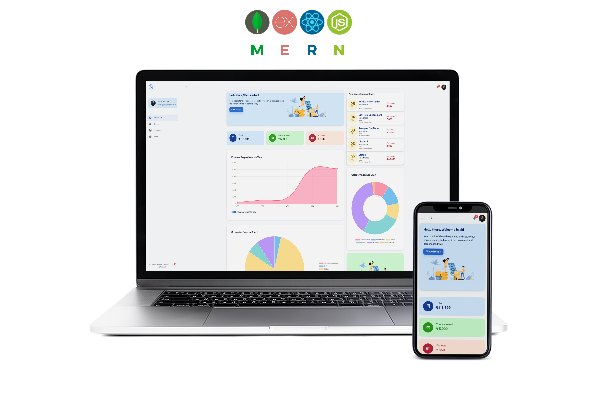
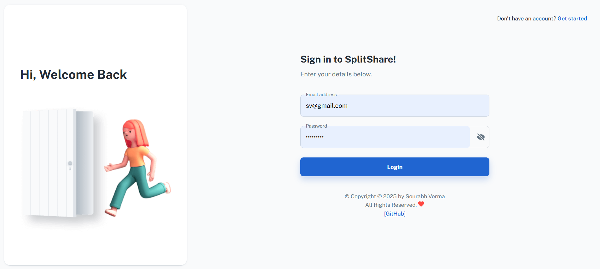
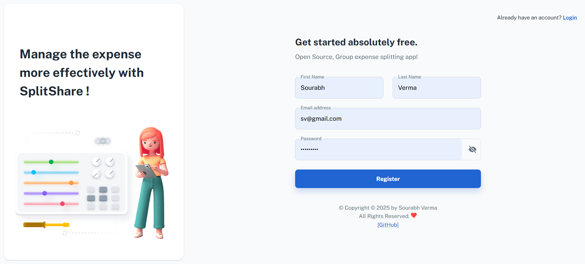
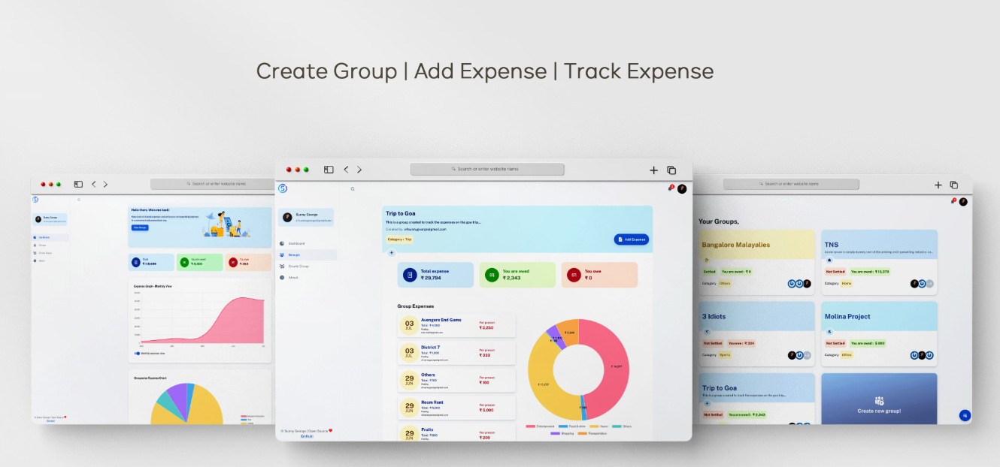
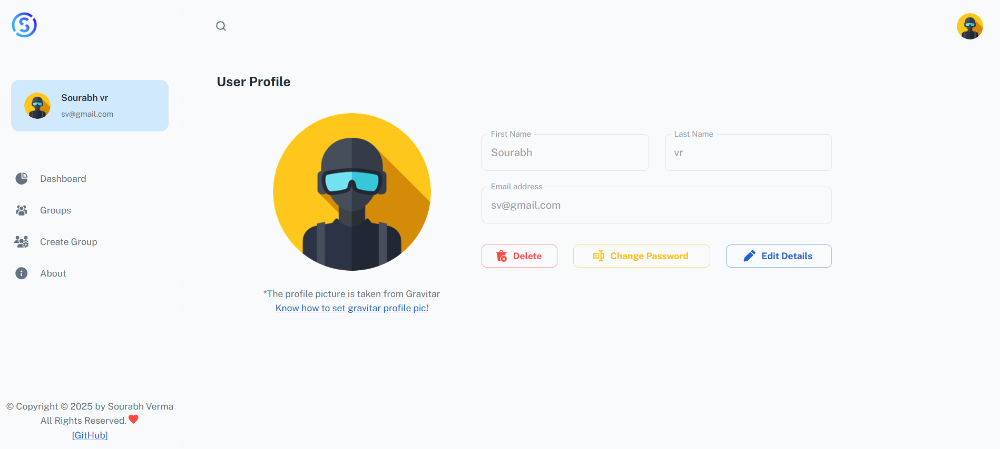

<h1 align="center">SplitShare</h1>


---

A full-stack group expense splitting application built with the MERN stack (MongoDB, Express, React, Node.js).

---

## 📖 Introduction

**SplitShare** is a group expense management app built using the MERN stack. It allows users to create groups, invite other users, and manage shared expenses efficiently. Users can:
Whether you're managing trips, shared rentals, or team expenses, SplitShare simplifies expense tracking and makes settling up easy and transparent.

---
## ✨ Features

### 🔐 Authentication
- Secure **login** and **signup** using JWT and bcrypt for password hashing.

### 📊 Dashboard
- Interactive **dashboard with charts and graphs** to visualize expenses clearly.
- View **group-wise summaries** and **individual spending trends**.

### 👥 Group Management
- **Create new groups** and invite people.
- **Rename or delete existing groups** easily.
- Manage members within each group.

### 💸 Expense Management
- **Add, update, or delete expenses** in specific groups.
- View **detailed breakdown of each expense**, including contributors.
- Track **expense slips and history** for transparency.

### 🔁 Settlement
- Automatically **calculate balances**.
- View **who owes whom** and **settle up** within the group.

  ---
## 📸 Screenshots

<table>
  <tr>
    <td align="center">
      <br>Login
    </td>
    <td align="center">
      <br>Signup
    </td>
    <td align="center">
      <br>Dashboard
    </td>
    <td align="center">
      <br>Group Page
    </td>
    <td align="center">
      <br>Profile
    </td>
    <td align="center">
      <br>Main Image
    </td>
  </tr>
</table>

---

## ⚙️ Technologies Used

### 🖥️ Frontend

- **React JS**
- **Redux** – State management
- **Axios** – HTTP communication
- **Material UI** – Component library
- **Chart.js & React-chartjs-2** – Analytics graphs
- **Gravatar** – Profile avatars

### 🛠️ Backend

- **Express JS**
- **Mongoose** – MongoDB object modeling
- **JWT** – Authentication
- **bcryptjs** – Password hashing
- **MongoDB Atlas** – Cloud-hosted NoSQL database

---

## 🚀 Getting Started

### Prerequisites

- Node.js
- MongoDB Atlas account
- Git

### Installation

1. Clone the repository:
   ```bash
   git clone https://github.com/sourabh1211/SplitShare.git
   cd SplitShare
